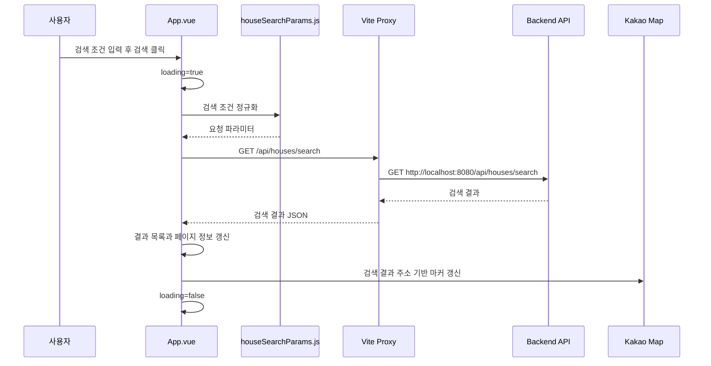
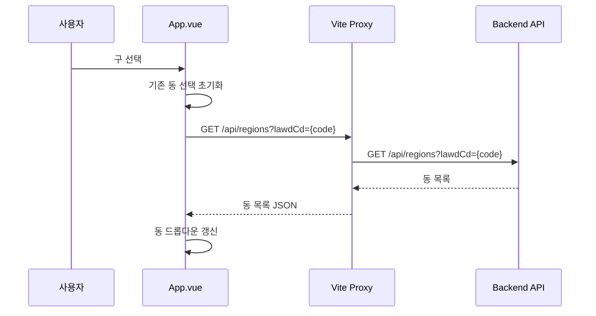

# NoHome Frontend

NoHome의 Vue/Vite 프론트엔드입니다. 사용자가 아파트 매매 실거래가를 검색하고, 결과 목록과 Kakao Map 지도에서 거래 위치를 확인할 수 있는 화면을 제공합니다.

전체 프로젝트 실행 순서는 `Artifact` 저장소의 `README.md`를 확인하세요.

## 기술 스택

- Vue
- Vite
- JavaScript
- Kakao Map JavaScript SDK

## Docker 구성

Frontend 저장소에는 Vite 개발 서버를 컨테이너로 실행하기 위한 `Dockerfile`과 빌드 context를 정리하기 위한 `.dockerignore`가 있습니다.

전체 서비스를 Docker로 실행할 때는 `Artifact/docker-compose.yml`이 이 저장소의 `Dockerfile`을 사용해 Frontend 이미지를 빌드합니다.

```text
Artifact/docker-compose.yml
  -> ../Frontend/Dockerfile
  -> frontend 서비스 컨테이너
```

## 환경 변수

처음 실행할 때 예시 파일을 복사해 `.env`를 만듭니다.

```powershell
Copy-Item .env.example .env
```

이 명령은 `Frontend/.env.example`에 들어 있는 예시값을 `Frontend/.env`로 복사합니다. 따라서 `.env.example`에는 프론트엔드 실행에 필요한 환경 변수 이름이 미리 준비되어 있어야 합니다.

Kakao JavaScript key 같은 실제 개인 key는 `.env.example`이 아니라 복사 후 생성된 `.env`에 입력합니다.

프론트엔드에서 사용하는 환경 변수:

```text
VITE_KAKAO_MAP_API_KEY=
VITE_API_PROXY_TARGET=http://localhost:8080
```

- `VITE_KAKAO_MAP_API_KEY`: Kakao Map JavaScript SDK key
- `VITE_API_PROXY_TARGET`: Vite 개발 서버가 `/api` 요청을 전달할 Backend 주소

Vite에서 브라우저 코드로 노출해야 하는 환경 변수는 `VITE_` prefix가 필요합니다.

`.env`는 로컬 비밀값을 포함할 수 있으므로 원격 저장소에 커밋하지 않습니다.

## Vite Proxy

로컬 개발 환경에서 프론트엔드는 `http://localhost:5173`에서 실행되고, 백엔드는 `http://localhost:8080`에서 실행됩니다.

프론트엔드의 `/api` 요청은 Vite proxy가 백엔드로 전달합니다.

```js
server: {
  proxy: {
    '/api': {
      target: 'http://localhost:8080',
      changeOrigin: true,
    },
  },
}
```

프론트엔드 코드에서는 백엔드 주소를 직접 조합하지 않고 상대 경로로 호출합니다.

```js
fetch('/api/houses/search?...')
```

이 구조를 사용하면 개발 중 브라우저는 `localhost:5173`에만 접속하고, API 요청은 Vite 개발 서버가 백엔드로 대신 전달합니다.

Docker Compose로 실행할 때는 Frontend 컨테이너 내부에서 Backend 컨테이너를 찾아야 하므로 `VITE_API_PROXY_TARGET`을 `http://backend:8080`으로 주입합니다. 이 값은 `Artifact/docker-compose.yml`에서 설정합니다.

## 주요 파일 구조

```text
src/
  App.vue                   검색 화면, 결과 목록, 지도 상태 관리
  houseSearchParams.js      검색 조건 정규화 및 API 요청 파라미터 생성
  houseSearchParams.test.js 검색 파라미터 생성 테스트
  main.js                   Vue 앱 진입점
  style.css                 전역 스타일
```

## API 호출 흐름



## 검색 파라미터 생성 규칙

`houseSearchParams.js`는 사용자가 입력한 검색 조건을 백엔드 API 요청 파라미터로 변환합니다.

- 거래 월 `YYYY-MM`은 `YYYYMM`으로 변환합니다.
- 서울시 구 이름은 `lawdCd`로 변환합니다.
- 구와 거래 월이 선택된 경우 `autoImport=true`를 전달합니다.
- 서울 전체 검색처럼 범위가 큰 요청은 자동 import를 끕니다.

## 동 목록 조회 흐름

구를 선택하면 해당 구의 `lawdCd`로 백엔드에 동 목록을 요청합니다.



## 지도 표시 흐름

검색 결과에 주소 정보가 있으면 Kakao Map geocoder를 사용해 좌표를 구하고 마커를 표시합니다.

```text
검색 결과 주소
  -> Kakao geocoder
  -> 좌표
  -> 지도 마커
```
